# Arquitetura Consolidada — Control Plane e Data Plane em Python

> Documento de referência para **GitHub Copilot**, **Agents**, **architecture-instructions**, **copilot-instructions.md** e **SKILLs de geração de código**.  
> Objetivo: fornecer contexto arquitetural suficiente para gerar o código-base do sistema de forma consistente.

---

## 1. Objetivo do sistema

Construir uma plataforma interna em Python para:

- backoffice administrativo;
- dashboards operacionais;
- reports parametrizados;
- jobs assíncronos;
- workflows de jobs encadeados;
- execução agendada via CRON;
- execução sob demanda;
- reexecução de falhas;
- monitoramento de execuções;
- auditoria;
- RBAC;
- integração com ADFS/OIDC;
- processamento via Data Plane;
- coordenação via Oracle Database.

A arquitetura será dividida em dois grandes blocos:

```text
Control Plane
- Governa, autentica, autoriza, configura, agenda e observa.

Data Plane
- Executa jobs, reports, workflows, compensações, e-mails e atualização de status.
```

---

## 2. Decisões arquiteturais principais

### 2.1 Separação entre Control Plane e Data Plane

```text
Control Plane:
- UI principal do usuário.
- Backoffice.
- Administração.
- RBAC.
- Dashboards.
- Execuções por demanda.
- Reexecuções.
- Auditoria.
- Saúde do Data Plane.
- Cadastro de Reports, Jobs, Workflows, Schedules e Credenciais.

Data Plane:
- Execução real de Jobs.
- Execução real de Reports.
- Execução de Workflows.
- Controle de steps.
- Compensações.
- Geração de artifacts.
- Envio de e-mails.
- Heartbeat para o Control Plane.
- Admin UI técnica simples para suporte.
```

### 2.2 Comunicação entre Control Plane e Data Plane

```text
Control Plane -> Data Plane:
- Via Oracle Database.
- Control Plane enfileira execuções nas tabelas de fila.
- Data Plane consome execuções pendentes no banco.

Data Plane -> Control Plane:
- Via API somente para Heartbeat.
- Data Plane envia status de saúde a cada 1 minuto.
```

### 2.3 Banco Oracle como mecanismo de coordenação

O Oracle será usado para:

- configurações;
- RBAC;
- auditoria;
- filas;
- schedules;
- execuções;
- logs de execução;
- artifacts;
- outbox de e-mail;
- heartbeat;
- cache/agregações de dashboard.

A fila será implementada com:

```sql
SELECT ... FOR UPDATE SKIP LOCKED
```

### 2.4 Sem SQLAlchemy

O projeto **não usará SQLAlchemy**.

Acesso ao Oracle:

```text
python-oracledb
SQL explícito
Repositories próprios
Connection pool próprio
Transaction manager próprio
```

### 2.5 Frontend

Decisão final:

```text
FastAPI + Jinja2 + HTMX + Alpine.js + Bootstrap 5
```

Motivação:

- time pequeno;
- forte conhecimento em backend e SQL;
- pouca experiência com SPA/frontend complexo;
- necessidade de backoffice, CRUD, tabelas, dashboards e drill down controlado;
- redução de complexidade de build, estado no cliente e stack JavaScript.

### 2.6 Control Plane por funcionalidades

O Control Plane será organizado por feature.

Cada feature segue a estrutura:

```text
routers/
api/
controllers/
usecases/
services/
repository/
dtos/
templates/
```

### 2.7 Data Plane por camadas

O Data Plane será organizado por camada.

Estrutura final:

```text
presentation/
application/
domain/
infrastructure/
workers/
```

O `domain` do Data Plane será **DTO-centric**:

```text
domain/
├── dtos/
├── repositories/
├── enums/
├── services/
└── exceptions/
```

Não serão usados:

```text
entities/
value_objects/
```

---

## 3. Stack de tecnologia

### 3.1 Frontend Control Plane

```text
FastAPI server-side rendering
Jinja2
HTMX
Alpine.js
Bootstrap 5
Lucide Icons ou Heroicons
Chart.js ou ECharts
```

### 3.2 Backend Control Plane

```text
Python
FastAPI
Pydantic
python-oracledb
ADFS/OIDC
RBAC interno
Oracle Database
Logs JSON
OpenTelemetry
Splunk
```

### 3.3 Data Plane

```text
Python workers
python-oracledb
Oracle queue
Scheduler via Oracle
Email Outbox
Heartbeat client
Report Generator
Workflow Runner
Saga/Compensation Runner
Admin UI técnica com Jinja2 + HTMX
```

### 3.4 Observabilidade

```text
OpenTelemetry
Logs JSON estruturados
Splunk HEC
correlation_id
trace_id
execution_code
```

### 3.5 Testes e qualidade

```text
pytest
pytest-mock
coverage.py
Ruff
mypy ou pyright
Playwright para fluxo web se necessário
```

---

## 4. Modelo C4 — Nível 2

### 4.1 Visão geral do sistema

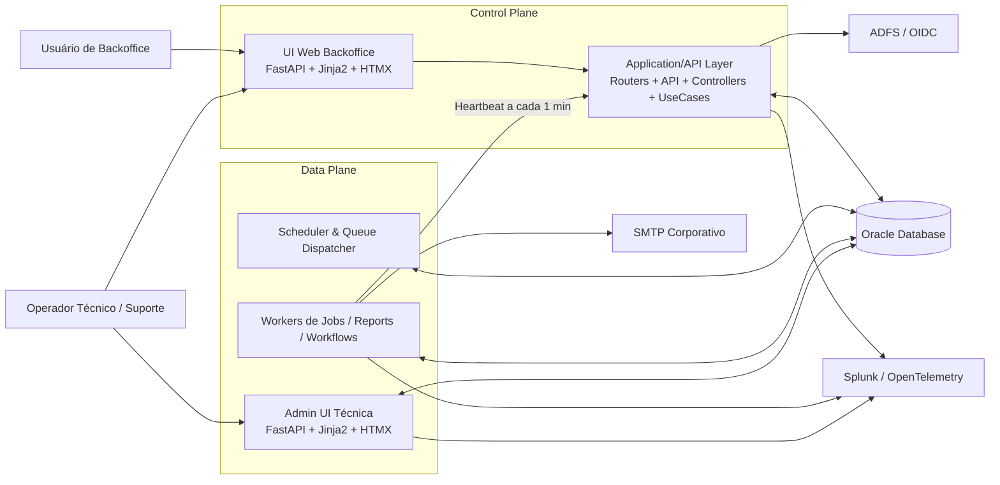

### 4.2 Zoom no Control Plane

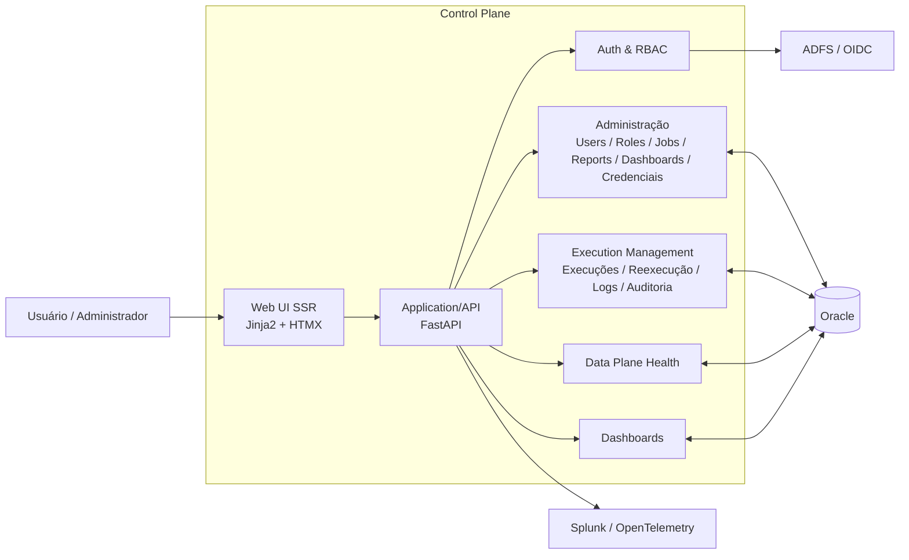

### 4.3 Zoom no Data Plane

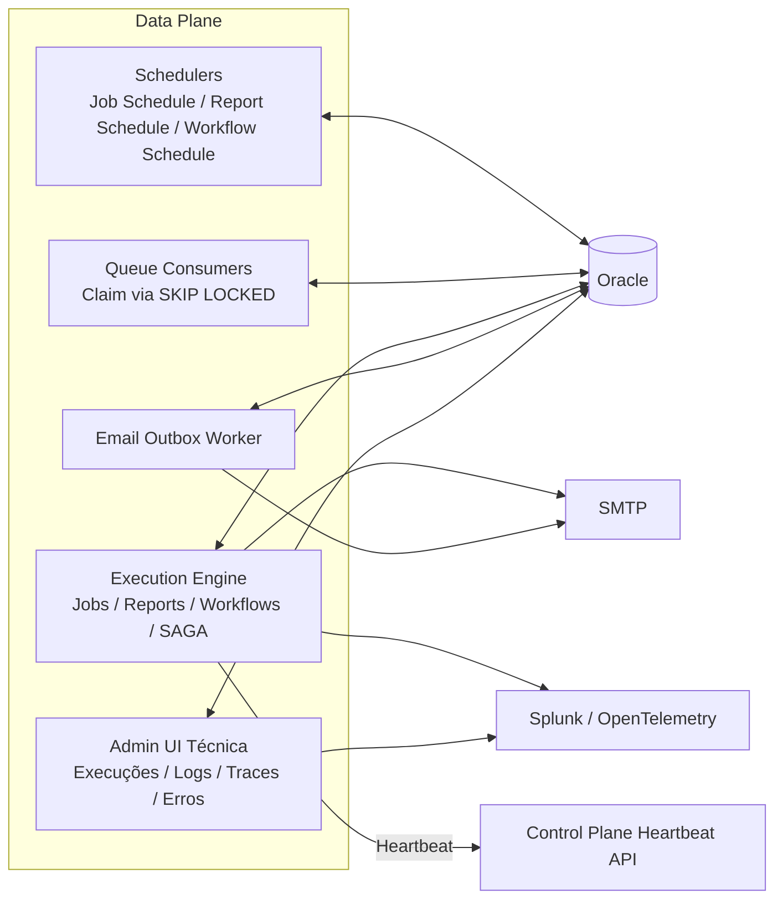

---

## 5. Fluxo de dados de alto nível

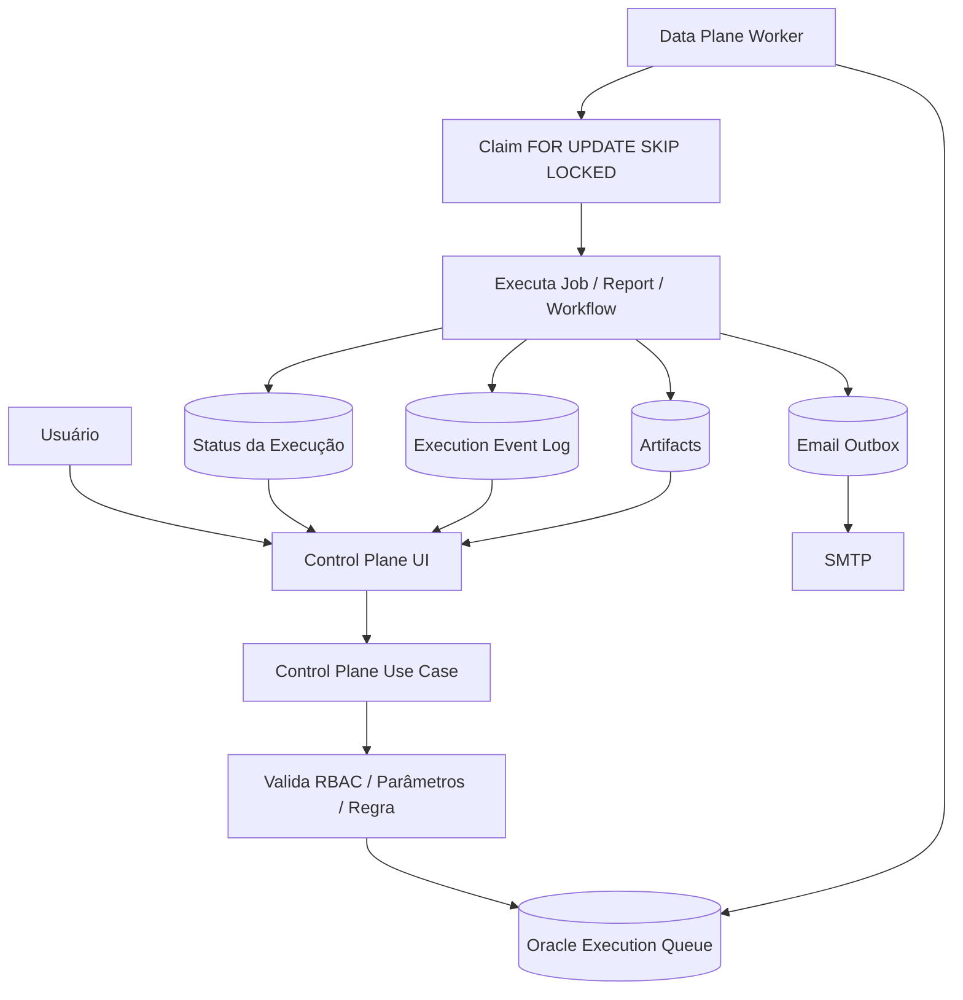

---

## 6. Principais tabelas conceituais

### 6.1 Reports

```text
REPORT_DATA_SOURCE
REPORT_DEFINITION
REPORT_DEFINITION_VERSION
REPORT_PARAMETER_DEFINITION
REPORT_COLUMN_FORMAT
REPORT_NOTIFICATION
REPORT_SCHEDULE
REPORT_SCHEDULE_PARAMETER
REPORT_EXECUTION_QUEUE
REPORT_ARTIFACT
```

### 6.2 Jobs

```text
JOB_HANDLER
JOB_DEFINITION
JOB_DEFINITION_VERSION
JOB_PARAMETER_DEFINITION
JOB_NOTIFICATION
JOB_SCHEDULE
JOB_SCHEDULE_PARAMETER
JOB_EXECUTION_QUEUE
JOB_ARTIFACT
```

### 6.3 Workflows

```text
JOB_WORKFLOW_DEFINITION
JOB_WORKFLOW_DEFINITION_VERSION
JOB_WORKFLOW_STEP
JOB_WORKFLOW_NOTIFICATION
JOB_WORKFLOW_SCHEDULE
JOB_WORKFLOW_SCHEDULE_PARAMETER
JOB_WORKFLOW_EXECUTION_QUEUE
JOB_WORKFLOW_STEP_EXECUTION
JOB_ARTIFACT
```

### 6.4 Execuções e logs

```text
EXECUTION_EVENT_LOG
EMAIL_OUTBOX
EMAIL_OUTBOX_ATTACHMENT
DATA_PLANE_INSTANCE
AUDIT_EVENT
CREDENTIAL_DEFINITION
```

### 6.5 Dashboards

```text
DASHBOARD_DEFINITION
DASHBOARD_WIDGET
DASHBOARD_DATASET
DASHBOARD_FILTER
DASHBOARD_DRILLDOWN
DASHBOARD_CACHE
```

---

## 7. Status de execução

Status técnicos padrão:

```text
PENDING
CLAIMED
RUNNING
WAITING_RETRY
SUCCEEDED
FAILED
CANCELLED
COMPENSATING
COMPENSATED
MANUAL_INTERVENTION_REQUIRED
```

Mapeamento visual:

| Status backend | Label UI | Badge |
|---|---|---|
| PENDING | Pendente | Cinza |
| CLAIMED | Reservado | Cinza |
| RUNNING | Executando | Azul com spinner |
| WAITING_RETRY | Aguardando retry | Amarelo |
| SUCCEEDED | Sucesso | Verde com check |
| FAILED | Falha | Vermelho clicável |
| CANCELLED | Cancelado | Cinza |
| COMPENSATING | Compensando | Amarelo |
| COMPENSATED | Compensado | Verde/Amarelo |
| MANUAL_INTERVENTION_REQUIRED | Intervenção manual | Vermelho/Amarelo |

---

## 8. Padrões de identidade e rastreabilidade

Cada execução deve ter:

```text
id técnico
execution_code
correlation_id
trace_id
idempotency_key
requested_by
requested_at
execution_origin
```

Padrões de execution code:

```text
REPORT-RUN-YYYYMMDD-000001
JOB-RUN-YYYYMMDD-000001
WF-RUN-YYYYMMDD-000001
```

Origens:

```text
MANUAL
SCHEDULED
RERUN
SYSTEM
```

Reexecução:

```text
rerun_of_execution_id
```

---

## 9. Sequências principais

### 9.1 Execução manual de Report

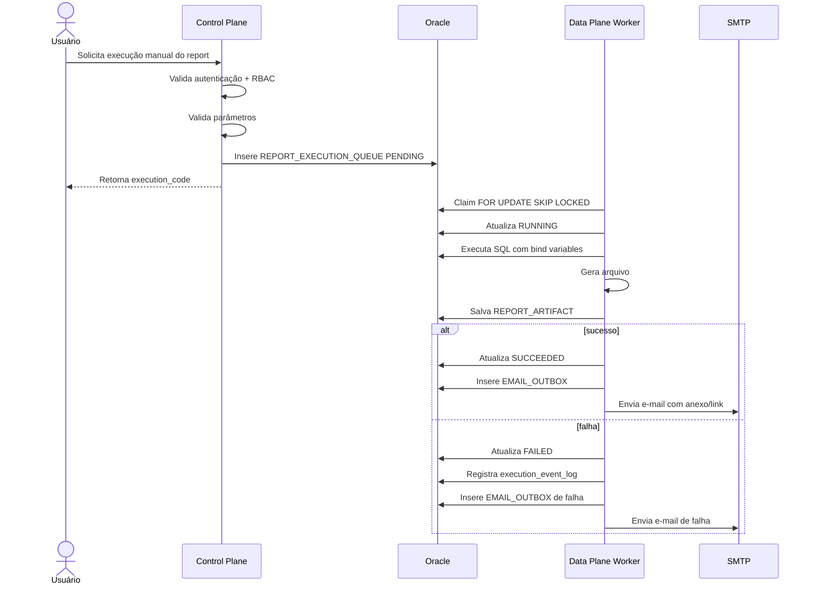

### 9.2 Execução automática de Job/Workflow

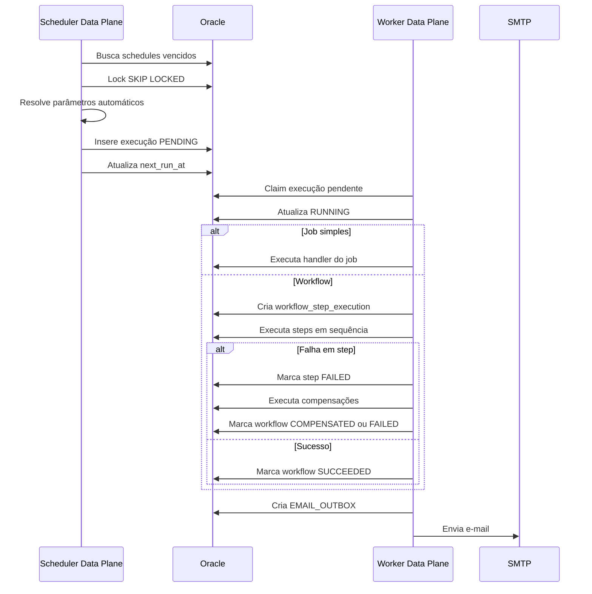

### 9.3 Reexecução de falha

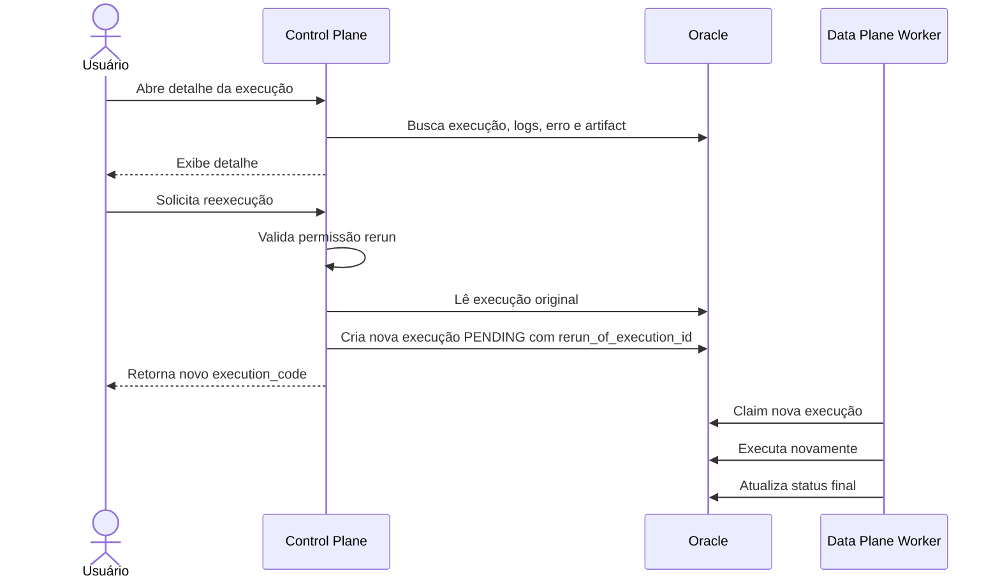

### 9.4 Heartbeat

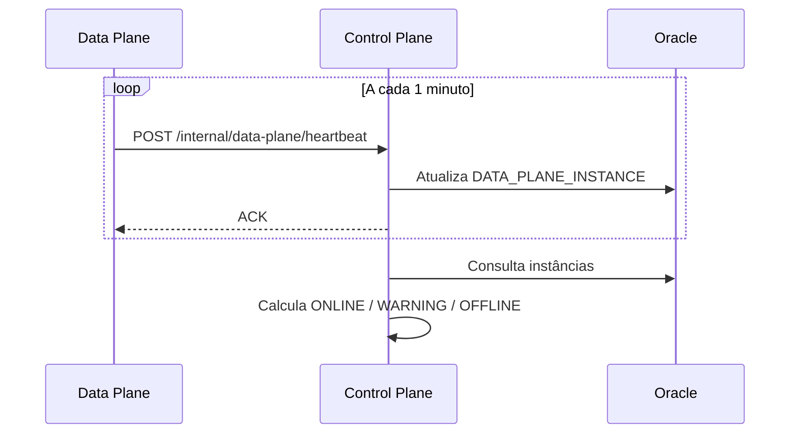

### 9.5 Dashboard com drill down

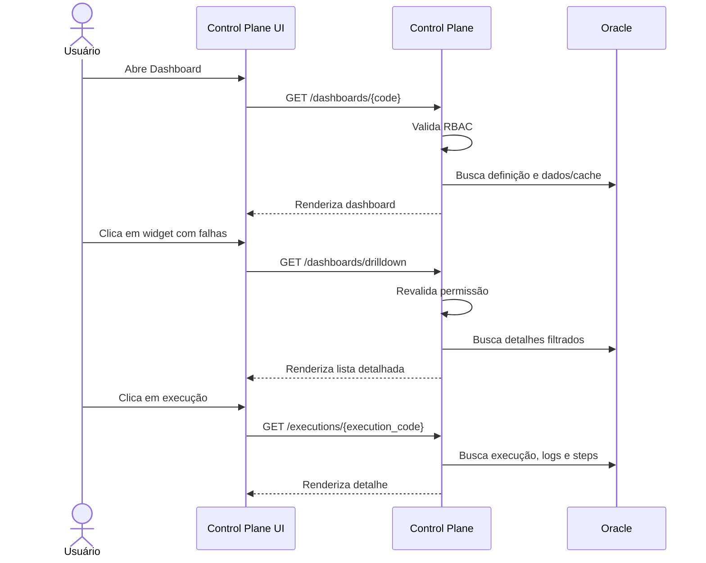

---

## 10. Reports

### 10.1 Funcionalidades

O usuário deve poder:

- cadastrar report;
- escolher fonte de dados;
- informar SQL SELECT;
- definir formato: CSV, TXT, XLSX, XLS legado;
- definir delimiter para CSV/TXT;
- definir nome do arquivo;
- definir parâmetros;
- definir formatação de colunas;
- definir e-mails;
- agendar via CRON;
- executar por demanda;
- reexecutar em caso de falha;
- ativar/desativar.

### 10.2 SQL de report

Regras obrigatórias:

```text
Somente SELECT.
Sem INSERT, UPDATE, DELETE, MERGE, DROP, ALTER, TRUNCATE, GRANT, EXEC.
Sem múltiplos comandos.
Usar bind variables.
Usuário read-only.
Timeout.
Limite máximo de linhas.
Versionamento.
Auditoria de alteração.
```

Exemplo correto:

```sql
SELECT
    customer_id,
    customer_name,
    amount,
    process_date
FROM financeiro.vw_sales_report
WHERE process_date = :process_date
```

### 10.3 Parâmetros automáticos

Expressões suportadas:

```text
d_minus_1
d_minus_7
d_plus_1
m_minus_1
y_minus_1
month_minus_1
period_minus_1m
```

Recomendações:

```text
d_minus_1       -> data atual - 1 dia
d_minus_7       -> data atual - 7 dias
d_plus_1        -> data atual + 1 dia
month_minus_1   -> primeiro dia do mês anterior
period_minus_1m -> competência anterior no formato YYYYMM
y_minus_1       -> data atual - 1 ano
```

### 10.4 Formatação de colunas

Exemplos:

```text
PROCESS_DATE -> YYYYMMDD
PROCESS_DATE -> YYYY-MM-DD
AMOUNT       -> R$ #.##0,00
AMOUNT       -> $ #,##0.00
```

---

## 11. Jobs

### 11.1 Funcionalidades

O usuário deve poder:

- escolher qual job executar;
- cadastrar job a partir de handlers disponíveis;
- definir parâmetros;
- definir agendamento CRON;
- ativar/desativar;
- executar por demanda;
- reexecutar falhas;
- configurar notificação;
- configurar nome de arquivo quando houver artifact.

### 11.2 Job Handler

O usuário **não cadastra código Python livre**.

O Data Plane possui handlers registrados:

```text
CUSTOMER_IMPORT_JOB
RECONCILIATION_JOB
FILE_PROCESSING_JOB
EXTERNAL_API_CALL_JOB
DATABASE_LOAD_JOB
DATABASE_TRANSFORM_JOB
DATABASE_SAVE_JOB
COMPENSATION_JOB
```

Cada handler é uma classe Python.

---

## 12. Workflows

### 12.1 Conceito

Workflow é uma sequência de jobs encadeados.

Cada step pode ter:

```text
ordem
job_definition
compensation_job_definition
retry_enabled
max_retries
timeout_seconds
on_failure_action
```

Ações de falha:

```text
STOP
RETRY
COMPENSATE
CONTINUE
MANUAL_INTERVENTION_REQUIRED
```

### 12.2 SAGA

Workflows críticos devem suportar compensação.

Fluxo típico:

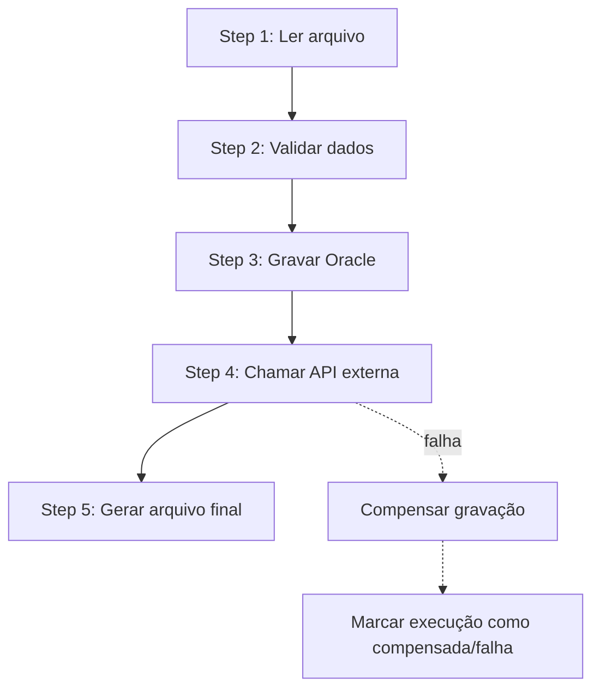

---

## 13. Dashboards

### 13.1 Módulo de dashboards

Entidades:

```text
DASHBOARD_DEFINITION
DASHBOARD_WIDGET
DASHBOARD_DATASET
DASHBOARD_FILTER
DASHBOARD_DRILLDOWN
DASHBOARD_CACHE
```

### 13.2 Tipos de widget

```text
CARD
TABLE
BAR_CHART
LINE_CHART
PIE_CHART
AREA_CHART
STATUS_LIST
HEATMAP
```

### 13.3 Drill down

Drill down deve ser controlado e revalidar RBAC a cada nível.

Exemplo:

```text
Resumo por status
-> Lista de execuções com falha
-> Detalhe da execução
-> Logs e stack trace, se permitido
```

### 13.4 Performance

Dashboards não devem executar consultas pesadas sempre em tempo real.

Estratégias:

```text
consulta direta para dados leves
dashboard_cache
tabelas agregadas atualizadas pelo Data Plane
materialized views se aplicável
```

---

## 14. RBAC e Segurança

### 14.1 Modelo

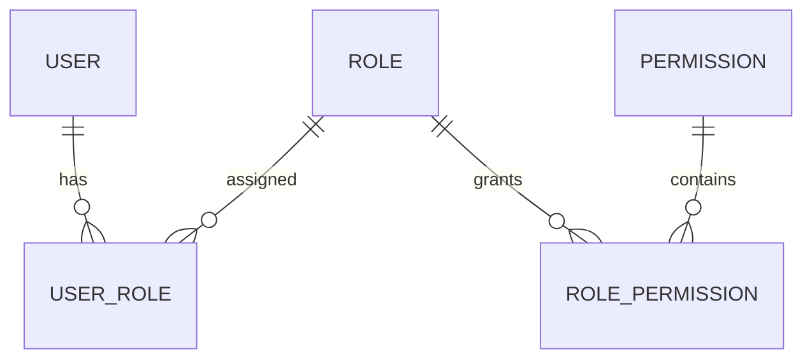

### 14.2 Permissões

Exemplos:

```text
reports.read
reports.write
reports.execution.create
reports.execution.rerun
reports.execution.view_logs

jobs.read
jobs.write
jobs.execution.create
jobs.execution.rerun
jobs.execution.view_logs

workflows.read
workflows.write
workflows.execution.create
workflows.execution.rerun
workflows.execution.view_logs

dashboards.read
dashboards.write
admin.users.write
admin.roles.write
admin.credentials.write
admin.audit.read
admin.dataplane.read
```

### 14.3 Regra principal

```text
Frontend pode esconder botões sem permissão.
Backend sempre deve validar permissão novamente.
```

---

## 15. Credenciais

Credenciais devem ser administradas por metadados.

Tabela conceitual:

```text
CREDENTIAL_DEFINITION
- credential_code
- name
- credential_type
- usage_context
- secret_reference
- enabled
```

Tipos:

```text
ORACLE_KERBEROS
SMTP
API_TOKEN
BASIC_AUTH
CERTIFICATE
SSH_KEY
FILE_SHARE
```

Segredo não deve ser exibido após salvar.

Preferência:

```text
Vault corporativo
```

Alternativa mínima:

```text
segredo criptografado no banco
chave fora do banco
acesso restrito
auditoria
```

---

## 16. Auditoria

Auditar:

```text
criação/alteração/desativação de usuário
alteração de roles
alteração de permissões
criação/alteração/desativação de report
alteração de SQL de report
criação/alteração/desativação de job
criação/alteração/desativação de workflow
alteração de schedule
alteração de credencial
execução manual
reexecução
cancelamento
download de artifact sensível
visualização de logs técnicos sensíveis
```

Tabela conceitual:

```text
AUDIT_EVENT
- event_time
- actor_user_id
- actor_login
- action
- resource_type
- resource_id
- before_json
- after_json
- ip_address
- user_agent
- correlation_id
- result
```

---

## 17. Observabilidade

### 17.1 Logs estruturados

Campos mínimos:

```json
{
  "timestamp": "2026-05-01T10:00:00-03:00",
  "level": "ERROR",
  "service": "data-plane-worker",
  "environment": "prod",
  "execution_code": "JOB-RUN-20260501-000001",
  "correlation_id": "corr-123",
  "trace_id": "trace-456",
  "data_plane_instance": "dp-prod-01",
  "step": "LOAD_FILE",
  "message": "Erro ao processar arquivo",
  "error_code": "FILE_PARSE_ERROR"
}
```

### 17.2 Execution Event Log

Eventos:

```text
EXECUTION_CREATED
EXECUTION_CLAIMED
EXECUTION_STARTED
STEP_STARTED
STEP_SUCCEEDED
STEP_FAILED
RETRY_SCHEDULED
COMPENSATION_STARTED
COMPENSATION_FINISHED
EXECUTION_SUCCEEDED
EXECUTION_FAILED
EMAIL_SENT
EMAIL_FAILED
```

---

## 18. Email Outbox

E-mail não deve ser enviado diretamente sem registro.

Fluxo:

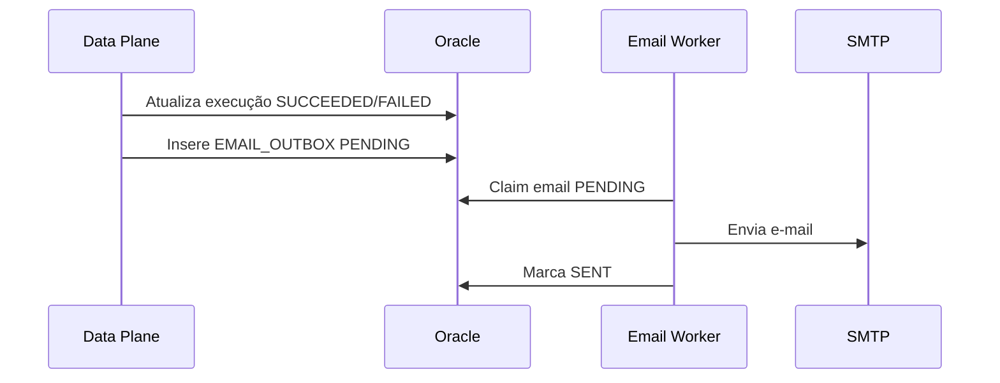

E-mails:

```text
JOB_SUCCESS
JOB_FAILURE
REPORT_SUCCESS
REPORT_FAILURE
WORKFLOW_SUCCESS
WORKFLOW_FAILURE
```

Reports podem anexar artifact ou link.

Regra:

```text
Se arquivo <= limite permitido, enviar anexo.
Se arquivo > limite permitido, enviar link seguro para download.
```

---

## 19. Design System e UX

### 19.1 Princípios

```text
Previsibilidade
Segurança
Transparência de estado
Consistência visual
Acessibilidade
```

### 19.2 Stack visual

```text
Jinja2
HTMX
Alpine.js
Bootstrap 5
CSS customizado com design tokens
```

### 19.3 Paleta

```css
:root {
  --app-bg: #F9FAFB;
  --app-surface: #FFFFFF;
  --app-primary: #1E40AF;
  --app-primary-hover: #1D4ED8;
  --app-danger: #B91C1C;
  --app-success: #15803D;
  --app-warning: #B45309;
  --app-border: #E5E7EB;
  --app-text: #111827;
}
```

### 19.4 Padrão de tela

```text
Breadcrumbs
Page Header
Filtros / Busca
Data Grid
Paginação
Side-over para criar/editar
Modal para confirmação
Toast para feedback
```

### 19.5 Data Grid obrigatório

Toda tabela deve ter:

```text
busca global
filtros
ordenação
exportação CSV
exportação Excel
paginação
seletor de itens por página
estado vazio
estado de carregamento
estado de erro
```

### 19.6 CRUD

```text
Adicionar/Editar:
- Side-over.

Excluir:
- Modal central.
- Título: Confirmar Exclusão.
- Texto: Esta ação não pode ser desfeita. Deseja continuar?
- Botões: Cancelar / Excluir.
```

### 19.7 Jobs assíncronos

```text
Toast imediato:
Solicitação recebida. A execução JOB-RUN-YYYYMMDD-000001 foi iniciada.

Status visível:
PENDING / RUNNING / SUCCEEDED / FAILED.

FAILED:
clicável para visualizar erro/log.
```

### 19.8 Checklist de tela

Toda tela deve ter:

```text
Breadcrumbs
Page header
Busca/filtros quando aplicável
Exportação quando aplicável
Feedback de sucesso/erro
Loading state
Empty state
Error state
Controle de permissão
Acessibilidade por teclado
```

---

## 20. Estrutura de camadas

### 20.1 Control Plane por feature

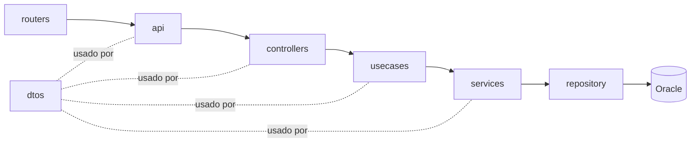

### 20.2 Data Plane por camadas

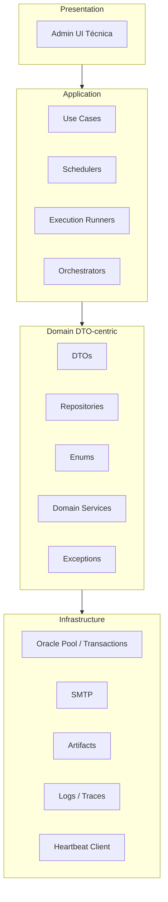

---

## 21. Estrutura de pastas — Control Plane

```text
control-plane/
├── app/
│   ├── main.py
│   ├── core/
│   │   ├── config/
│   │   ├── security/
│   │   ├── observability/
│   │   └── db/
│   ├── shared/
│   │   ├── dtos/
│   │   ├── exceptions/
│   │   ├── utils/
│   │   └── components/
│   ├── features/
│   │   ├── reports/
│   │   │   ├── routers/
│   │   │   ├── api/
│   │   │   ├── controllers/
│   │   │   ├── usecases/
│   │   │   ├── services/
│   │   │   ├── repository/
│   │   │   ├── dtos/
│   │   │   └── templates/
│   │   ├── jobs/
│   │   ├── workflows/
│   │   ├── executions/
│   │   ├── dashboards/
│   │   ├── admin_users/
│   │   ├── admin_roles/
│   │   ├── credentials/
│   │   ├── audit/
│   │   └── dataplane_health/
│   ├── templates/
│   │   ├── layouts/
│   │   └── components/
│   └── static/
│       ├── css/
│       ├── js/
│       └── images/
├── tests/
└── pyproject.toml
```

---

## 22. Estrutura de pastas — Data Plane

```text
data-plane/
├── app/
│   ├── main_worker.py
│   ├── main_admin_ui.py
│   ├── presentation/
│   │   ├── admin_ui/
│   │   │   ├── routers/
│   │   │   ├── controllers/
│   │   │   ├── views/
│   │   │   └── templates/
│   │   └── internal/
│   ├── application/
│   │   ├── usecases/
│   │   ├── orchestrators/
│   │   ├── schedulers/
│   │   ├── runners/
│   │   └── services/
│   ├── domain/
│   │   ├── dtos/
│   │   ├── repositories/
│   │   ├── enums/
│   │   ├── services/
│   │   └── exceptions/
│   ├── infrastructure/
│   │   ├── config/
│   │   ├── db/
│   │   │   └── sql/
│   │   ├── email/
│   │   ├── files/
│   │   ├── observability/
│   │   └── control_plane/
│   ├── workers/
│   └── scripts/
├── tests/
└── pyproject.toml
```

---

## 23. Data Plane Admin UI

A Admin UI técnica do Data Plane deve permitir visualizar:

```text
execuções
logs
traces
erros
filas
leases vencidos
artifacts
saúde dos workers
último heartbeat
```

Diagrama:

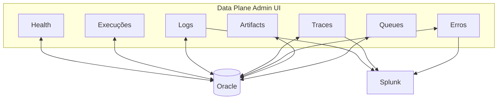

---

## 24. Catálogo de classes — Resumo

### 24.1 Control Plane

```text
Controllers
Use Cases
Services
Repositories
DTOs
ViewModels
Security
Audit
Observability
HTMX/Jinja Helpers
```

### 24.2 Data Plane

```text
DTOs
Repositories dentro de domain
Domain Services
Use Cases
Orchestrators
Runners
Schedulers
Workers
Job Handlers
Report Generators
Infrastructure Clients
Admin UI técnica
```

---

## 25. Motivo de existir cada família de classes

### Controllers

Coordenam requisições da interface/API.

Não devem conter regra de negócio pesada.

### Use Cases

Representam ações reais do sistema.

Exemplos:

```text
ExecuteReportManuallyUseCase
RerunJobExecutionUseCase
ReceiveDataPlaneHeartbeatUseCase
```

### Services

Concentram regras reutilizáveis.

Exemplos:

```text
ReportSqlValidationService
RbacService
DataPlaneHealthService
```

### Repositories

Isolam acesso ao Oracle.

Como não existe SQLAlchemy, repositories concentram SQL explícito.

### DTOs

Padronizam transporte de dados entre camadas.

### ViewModels

Preparam dados para Jinja2/HTMX.

Exemplo:

```text
StatusBadgeViewModel
DataGridViewModel
ExecutionTimelineViewModel
```

### Security

Isola autenticação, autorização e contexto do usuário.

### Audit

Registra ações sensíveis e operações importantes.

### Observability

Padroniza logs, traces, métricas e correlation_id.

### HTMX/Jinja Helpers

Padronizam fragments, toasts, side-overs, modais e respostas parciais.

### Domain Services do Data Plane

Regras operacionais de execução.

Exemplos:

```text
ParameterResolverService
RetryPolicyService
CompensationService
ArtifactNamingService
```

### Orchestrators

Coordenam fluxos longos e SAGA.

### Runners

Executam tecnicamente jobs, reports, workflows e e-mails.

### Schedulers

Transformam CRON em execução pendente.

### Workers

Processos contínuos que consomem filas e chamam use cases.

### Job Handlers

Implementam jobs reais.

### Report Generators

Geram arquivos CSV, TXT, XLSX e XLS.

### Infrastructure Clients

Integram com Oracle, SMTP, Splunk e Control Plane.

### Admin UI técnica

Dá visibilidade operacional ao Data Plane.

---

## 26. Lista mínima de classes para MVP

### 26.1 Control Plane MVP

```text
Settings
OraclePool
OracleTransactionManager
AdfsTokenValidator
PermissionChecker
RbacService
AuditService

ReportController
ReportService
ReportRepository
ReportExecutionRepository
ExecuteReportManuallyUseCase
ListReportExecutionsUseCase
GetReportExecutionDetailUseCase

JobController
JobService
JobRepository
JobExecutionRepository
ExecuteJobManuallyUseCase
ListJobExecutionsUseCase

ExecutionController
ExecutionManagementService
ExecutionEventLogRepository

DataPlaneHeartbeatController
DataPlaneHeartbeatService
DataPlaneInstanceRepository
```

### 26.2 Data Plane MVP

```text
Settings
OraclePool
OracleTransactionManager

JobExecutionDTO
ReportExecutionDTO
ExecutionLogDTO
EmailOutboxDTO
HeartbeatDTO

JobExecutionRepository
ReportExecutionRepository
ExecutionLogRepository
EmailOutboxRepository
HeartbeatRepository

ClaimNextJobUseCase
ClaimNextReportUseCase
ExecuteJobUseCase
ExecuteReportUseCase
SendEmailOutboxUseCase
SendHeartbeatUseCase

JobWorker
ReportWorker
EmailWorker
HeartbeatWorker

JobRunner
ReportRunner
EmailRunner

ReportGenerator
CsvReportGenerator
XlsxReportGenerator
ArtifactStore
SmtpClient
ControlPlaneHeartbeatClient
```

---

## 27. Regras para Copilot/Agents

### 27.1 Regras gerais

```text
Sempre respeitar a separação Control Plane e Data Plane.
Não criar comunicação direta Control Plane -> Data Plane por API.
Control Plane enfileira no Oracle.
Data Plane consome do Oracle.
Data Plane chama Control Plane apenas para heartbeat.
Não usar SQLAlchemy.
Usar python-oracledb.
Usar DTOs para comunicação entre camadas.
Usar SQL explícito em repositories.
Não executar job/report pesado em request HTTP.
```

### 27.2 Regras do Control Plane

```text
Organizar por funcionalidade.
Cada feature deve conter routers/api/controllers/usecases/services/repository/dtos/templates.
Usar FastAPI + Jinja2 + HTMX.
Usar Pydantic para DTOs de request/response quando aplicável.
Usar ViewModels para renderização de templates.
Validar RBAC em todos os endpoints sensíveis.
Registrar auditoria em ações administrativas.
```

### 27.3 Regras do Data Plane

```text
Organizar por camadas.
Não usar entities e value_objects.
Usar DTOs em domain/dtos.
Colocar repositories em domain/repositories.
Usar services em domain/services para regras operacionais.
Workers chamam use cases.
Use cases chamam repositories, services, runners e orchestrators.
Infrastructure cuida de Oracle, SMTP, artifacts, Splunk e heartbeat client.
```

### 27.4 Regras de banco

```text
Usar FOR UPDATE SKIP LOCKED para claim de filas.
Nunca manter lock durante execução longa.
Claim deve marcar execução como CLAIMED e fazer commit.
Execução real ocorre fora da transação de claim.
Usar lease_until para recuperação de falha.
Usar idempotency_key.
Usar execution_code.
Registrar execution_event_log.
```

### 27.5 Regras de reports

```text
Somente SELECT.
Sempre usar bind variables.
Validar SQL antes de ativar.
Versionar definição.
Gerar artifact.
Criar email outbox.
```

### 27.6 Regras de jobs/workflows

```text
Usuário não cadastra código Python livre.
Usuário escolhe handlers registrados.
Workflow é sequência de jobs.
Steps podem ter retry e compensação.
Registrar cada step.
```

### 27.7 Regras de UX

```text
Toda tela deve ter breadcrumbs.
Toda tabela deve ter busca, filtros, ordenação, exportação e paginação.
Criar/editar via side-over.
Excluir via modal de confirmação.
Ações assíncronas devem retornar toast com execution_code.
Status FAILED deve permitir visualizar erro/log.
```

---

## 28. Sugestão de Agents

### 28.1 Architecture Agent

Responsável por garantir aderência à arquitetura.

```text
Valida camadas.
Valida dependências.
Impede SQLAlchemy.
Impede execução pesada no Control Plane.
Garante uso de Oracle queue.
```

### 28.2 Control Plane Agent

Gera features do Control Plane.

```text
routers
api handlers
controllers
usecases
services
repositories
dtos
templates Jinja2
HTMX fragments
```

### 28.3 Data Plane Agent

Gera workers e execução.

```text
workers
usecases
runners
orchestrators
domain DTOs
domain repositories
domain services
infrastructure clients
```

### 28.4 Database Agent

Gera DDL e SQL.

```text
tabelas
índices
constraints
queries de claim
queries de status
queries de auditoria
```

### 28.5 UX Agent

Gera templates consistentes.

```text
breadcrumbs
page headers
data grids
side-overs
modals
toasts
badges
loading states
empty states
```

### 28.6 Testing Agent

Gera testes.

```text
pytest
mocks
testes de use case
testes de repository
testes de worker
testes de permission
```

---

## 29. Sugestão de SKILLs

```text
skill-control-plane-feature-generator
skill-data-plane-worker-generator
skill-oracle-repository-generator
skill-report-generator
skill-job-handler-generator
skill-workflow-generator
skill-htmx-template-generator
skill-rbac-generator
skill-audit-generator
skill-observability-generator
skill-test-generator
```

Cada SKILL deve receber:

```text
nome da feature
entidades/tabelas envolvidas
DTOs necessários
permissões necessárias
fluxos de execução
templates necessários
testes esperados
```

---

## 30. Prompt base para geração de código

```text
Você é um agente de engenharia responsável por gerar código para uma arquitetura Python dividida em Control Plane e Data Plane.

Regras obrigatórias:
- Não usar SQLAlchemy.
- Usar python-oracledb.
- Control Plane usa FastAPI + Jinja2 + HTMX.
- Data Plane usa workers Python.
- Comunicação Control Plane -> Data Plane ocorre via Oracle Database.
- Data Plane -> Control Plane apenas via heartbeat API.
- Control Plane organizado por funcionalidade.
- Data Plane organizado por camadas.
- Data Plane domain contém dtos, repositories, enums, services e exceptions.
- Não criar entities nem value_objects no Data Plane.
- Usar DTOs entre camadas.
- Usar repositories para SQL explícito.
- Usar execution_code, correlation_id e trace_id.
- Usar audit_event para ações sensíveis.
- Usar execution_event_log para logs de execução.
- Usar Email Outbox para notificações.
- Usar FOR UPDATE SKIP LOCKED para claim de filas.

Ao gerar código:
1. Crie arquivos nos diretórios corretos.
2. Gere código simples, legível e testável.
3. Não coloque regra de negócio no router.
4. Não coloque SQL fora de repository.
5. Não execute job/report pesado no request HTTP.
6. Inclua tratamento de erro.
7. Inclua logs estruturados.
8. Inclua testes quando solicitado.
```

---

## 31. ADRs recomendadas

```text
ADR-001: Separar Control Plane e Data Plane.
ADR-002: Comunicação Control Plane -> Data Plane via Oracle Database.
ADR-003: Data Plane chama Control Plane somente para Heartbeat.
ADR-004: Não usar SQLAlchemy.
ADR-005: Usar python-oracledb com SQL explícito.
ADR-006: Usar Jinja2 + HTMX no frontend.
ADR-007: Usar Design System obrigatório no Control Plane.
ADR-008: Usar filas Oracle com FOR UPDATE SKIP LOCKED.
ADR-009: Usar Email Outbox.
ADR-010: Versionar Reports, Jobs e Workflows.
ADR-011: Data Plane organizado por camadas.
ADR-012: Data Plane domain DTO-centric, sem entities/value_objects.
ADR-013: Repositories do Data Plane dentro de domain/repositories.
ADR-014: Usar execution_code, correlation_id e trace_id.
ADR-015: Usar Admin UI técnica simples no Data Plane.
```

---

## 32. Definition of Done arquitetural

Uma implementação só está aderente se:

```text
respeita separação Control Plane/Data Plane
não usa SQLAlchemy
usa python-oracledb
tem DTOs claros
tem repositories isolando SQL
tem logs com correlation_id
tem auditoria quando aplicável
tem RBAC no backend
tem templates consistentes
tem status de execução persistido
tem tratamento de erro
tem testes para use cases principais
```

---

## 33. Próximos passos sugeridos

1. Criar `copilot-instructions.md`.
2. Criar `architecture-instructions.md`.
3. Criar `AGENTS.md` com os agentes especializados.
4. Criar SKILLs por tipo de geração.
5. Gerar o esqueleto dos projetos:
   - `control-plane`
   - `data-plane`
6. Gerar DDL inicial.
7. Gerar MVP:
   - execução manual de report;
   - execução manual de job;
   - heartbeat;
   - execution management;
   - email outbox;
   - logs de execução.
8. Evoluir para schedules e workflows.
9. Evoluir para dashboards e drill down.
10. Evoluir para Design System completo.
