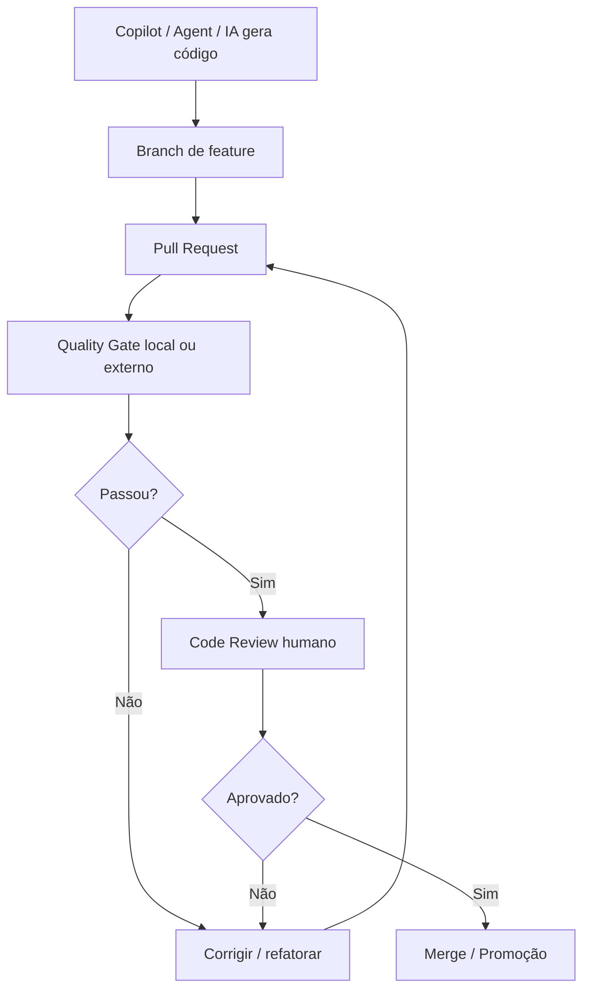

# Governança de Qualidade para Código Gerado por IA — Copilot, Agents e CI/CD Externo

> Documento de aplicação prática para projetos que utilizam GitHub Copilot, Agents, prompts, automações ou qualquer ferramenta de IA para gerar código.
>
> Objetivo: garantir que o código gerado por IA respeite a arquitetura definida, seja testável, seguro, legível, rastreável e aceito somente após validação automática e revisão humana.

---

## 1. Princípio central

Código gerado por IA **não deve ser tratado como código pronto**.

Ele deve ser tratado como um **rascunho técnico acelerado**, que só pode ser aceito quando passar por:

```text
guardrails de arquitetura
linters
formatadores
análise estática
testes automatizados
cobertura mínima
validação de segurança
revisão humana
quality gate externo
```

Política do projeto:

```text
A IA pode gerar código, testes e templates,
mas não pode decidir sozinha que o código está pronto.

Código gerado por IA só é aceito quando demonstra aderência arquitetural,
qualidade técnica, segurança, testes, rastreabilidade e revisão humana.
```

---

## 2. Arquitetura de referência

Este documento assume uma arquitetura Python dividida em:

```text
Control Plane
- Governa, autentica, autoriza, configura, agenda, observa e oferece UI de backoffice.

Data Plane
- Executa jobs, reports, workflows, compensações, e-mails, artifacts e atualizações de status.
```

Regras centrais:

```text
Control Plane -> Data Plane:
- Comunicação via Oracle Database.
- Control Plane enfileira execuções no Oracle.
- Data Plane consome execuções pendentes do Oracle.

Data Plane -> Control Plane:
- Somente heartbeat via API.

Banco:
- Oracle Database.
- python-oracledb.
- SQL explícito.
- Repositories próprios.
- Sem SQLAlchemy.
```

---

## 3. Modelo operacional

Fluxo obrigatório:



Regra:

```text
A solução externa de CI/CD não define a qualidade.
Ela apenas executa e impõe a qualidade definida no projeto.
```

---

## 4. Estrutura recomendada no repositório

Mesmo que o CI/CD seja externo, o projeto deve conter os contratos de qualidade.

```text
project-root/
├── .github/
│   ├── copilot-instructions.md
│   ├── pull_request_template.md
│   └── instructions/
│       ├── control-plane.instructions.md
│       ├── data-plane.instructions.md
│       ├── database.instructions.md
│       ├── security.instructions.md
│       ├── tests.instructions.md
│       └── ux.instructions.md
├── docs/
│   ├── architecture-instructions.md
│   ├── allowed-stack.md
│   ├── quality-policy.md
│   └── ai-code-generation-policy.md
├── scripts/
│   ├── architecture_guard.py
│   ├── quality_gate.sh
│   └── quality_report.py
├── reports/
├── pyproject.toml
├── requirements-dev.txt
├── Makefile
├── control-plane/
├── data-plane/
└── tests/
```

---

# PARTE 1 — GUARDRAILS PARA COPILOT

---

## 5. `.github/copilot-instructions.md`

Criar o arquivo:

```text
.github/copilot-instructions.md
```

Conteúdo sugerido:

```md
# Instruções obrigatórias para GitHub Copilot

Este projeto usa arquitetura Python dividida em Control Plane e Data Plane.

## Regras gerais obrigatórias

- Não usar SQLAlchemy.
- Usar python-oracledb.
- Usar SQL explícito apenas em repositories.
- Não colocar SQL em routers, controllers, use cases ou services.
- Usar DTOs para transporte de dados entre camadas.
- Não executar jobs, reports ou workflows pesados durante request HTTP.
- Control Plane apenas enfileira execuções no Oracle.
- Data Plane consome execuções pendentes no Oracle.
- Data Plane chama Control Plane somente para heartbeat.
- Todo código novo deve ter testes automatizados.
- Todo fluxo sensível deve validar RBAC no backend.
- Toda ação administrativa ou sensível deve registrar audit_event.
- Toda execução deve usar execution_code, correlation_id e trace_id.
- Toda execução deve registrar execution_event_log.
- Não gerar código com secrets hardcoded.
- Não gerar código com senha, token, certificado ou chave privada em texto claro.

## Organização do Control Plane

- Organizar por funcionalidade.
- Cada feature deve conter:
  - routers
  - api
  - controllers
  - usecases
  - services
  - repository
  - dtos
  - templates
- Routers não devem conter regra de negócio.
- Controllers coordenam request e response.
- Use cases representam ações reais do sistema.
- Services concentram regras reutilizáveis.
- Repositories isolam acesso ao Oracle.
- ViewModels preparam dados para Jinja2/HTMX.

## Organização do Data Plane

- Organizar por camadas:
  - presentation
  - application
  - domain
  - infrastructure
  - workers
- O domain é DTO-centric.
- Não criar entities.
- Não criar value_objects.
- Repositories ficam em domain/repositories.
- Workers chamam use cases.
- Use cases chamam repositories, domain services, runners e orchestrators.
- Infrastructure contém Oracle, SMTP, artifacts, observability e heartbeat client.

## Banco de dados

- Usar FOR UPDATE SKIP LOCKED para claim de filas.
- Nunca manter lock durante execução longa.
- Claim deve marcar execução como CLAIMED e fazer commit.
- Execução real ocorre fora da transação de claim.
- Usar lease_until para recuperação de falha.
- Usar idempotency_key.
- Usar execution_code.
- Registrar execution_event_log.

## UX

- Toda tela deve ter breadcrumbs.
- Toda tabela deve ter busca, filtros, ordenação, exportação e paginação.
- Criar/editar deve usar side-over.
- Excluir deve usar modal de confirmação.
- Ações assíncronas devem retornar toast com execution_code.
- Status FAILED deve permitir visualizar erro/log.
```

---

## 6. `.github/instructions/control-plane.instructions.md`

```md
# Control Plane Instructions

## Stack

- Python
- FastAPI
- Jinja2
- HTMX
- Alpine.js
- Bootstrap 5
- Pydantic
- python-oracledb

## Estrutura por feature

Cada feature deve seguir:

```text
features/{feature_name}/
├── routers/
├── api/
├── controllers/
├── usecases/
├── services/
├── repository/
├── dtos/
└── templates/
```

## Regras

- Router deve ser fino.
- Router não acessa banco.
- Router não contém regra de negócio.
- Controller coordena entrada, saída e ViewModels.
- Use case executa uma ação de aplicação.
- Service contém regra reutilizável.
- Repository contém SQL explícito.
- Templates não contêm regra de negócio.
- Todo endpoint sensível deve validar RBAC.
- Toda ação sensível deve auditar.
- Toda ação assíncrona deve retornar execution_code.
- Não executar job/report pesado no request HTTP.
- Enfileirar execução no Oracle.
```

---

## 7. `.github/instructions/data-plane.instructions.md`

```md
# Data Plane Instructions

## Stack

- Python workers
- python-oracledb
- Oracle queue
- SMTP
- Email Outbox
- OpenTelemetry
- Logs JSON

## Estrutura por camada

```text
data-plane/app/
├── presentation/
├── application/
├── domain/
│   ├── dtos/
│   ├── repositories/
│   ├── enums/
│   ├── services/
│   └── exceptions/
├── infrastructure/
└── workers/
```

## Regras

- Domain é DTO-centric.
- Não criar entities.
- Não criar value_objects.
- Repositories ficam dentro de domain/repositories.
- Workers chamam use cases.
- Use cases chamam repositories, services, runners e orchestrators.
- Infrastructure contém integrações técnicas.
- Nunca manter lock durante execução longa.
- Claim deve fazer commit antes de executar.
- Registrar execução em execution_event_log.
- Usar idempotency_key.
- Usar lease_until para recuperação de execução.
- Usar Email Outbox para envio de e-mails.
```

---

## 8. `.github/instructions/database.instructions.md`

```md
# Database Instructions

## Banco

- Oracle Database.
- python-oracledb.
- SQL explícito.
- Sem SQLAlchemy.

## Regras SQL

- SQL deve estar somente em repositories ou arquivos SQL em infrastructure/db/sql.
- Usar bind variables.
- Não concatenar parâmetros de usuário em SQL.
- Usar SELECT ... FOR UPDATE SKIP LOCKED para claim de filas.
- Nunca manter lock durante execução longa.
- Criar índices para colunas de busca, status, schedule e correlation.
- Toda alteração sensível deve ser auditável.
- Toda execução deve ter execution_code, correlation_id e trace_id.
- Usar idempotency_key quando houver risco de duplicidade.

## Reports

- Reports só podem executar SELECT.
- Bloquear INSERT, UPDATE, DELETE, MERGE, DROP, ALTER, TRUNCATE, GRANT e EXEC.
- Bloquear múltiplos comandos.
- Usar timeout.
- Usar limite máximo de linhas.
- Versionar definição do report.
```

---

## 9. `.github/instructions/security.instructions.md`

```md
# Security Instructions

## Regras obrigatórias

- Não gerar secrets hardcoded.
- Não logar senha, token, Authorization header, cookie, certificado ou chave privada.
- Não exibir segredo após salvar.
- Validar RBAC no backend.
- Não confiar apenas em botão escondido no frontend.
- Auditar alterações sensíveis.
- Usar bind variables para SQL.
- Não concatenar input do usuário em SQL.
- Não retornar stack trace completo para usuário final.
- Logs técnicos sensíveis só podem ser visíveis para usuários autorizados.

## Ações que exigem auditoria

- criação/alteração/desativação de usuário;
- alteração de roles;
- alteração de permissões;
- criação/alteração/desativação de report;
- alteração de SQL de report;
- criação/alteração/desativação de job;
- criação/alteração/desativação de workflow;
- alteração de schedule;
- alteração de credencial;
- execução manual;
- reexecução;
- cancelamento;
- download de artifact sensível;
- visualização de logs técnicos sensíveis.
```

---

## 10. `.github/instructions/tests.instructions.md`

```md
# Test Instructions

Todo código novo deve vir com testes.

## Obrigatório testar

- fluxo de sucesso;
- fluxo de erro;
- entrada inválida;
- usuário sem permissão;
- regra de negócio principal;
- auditoria quando aplicável;
- logs ou execution_event_log quando aplicável;
- idempotência quando aplicável.

## Ferramentas

- pytest
- pytest-mock
- coverage.py
- FastAPI TestClient
- Playwright quando necessário para fluxo web

## Cobertura mínima

- Use Cases: 90%
- Services: 90%
- Workers: 85%
- Repositories críticos: 80%
- Controllers/Routers: 75%
- Global: 85%

## Regras

- Não gerar testes decorativos.
- Testes devem validar comportamento.
- Testes não devem apenas verificar se mock foi chamado.
- Preferir Given/When/Then nos nomes ou estrutura dos testes.
```

---

## 11. `.github/instructions/ux.instructions.md`

```md
# UX Instructions

## Stack

- Jinja2
- HTMX
- Alpine.js
- Bootstrap 5

## Padrão obrigatório de tela

Toda tela deve ter:

- breadcrumbs;
- page header;
- filtros ou busca quando aplicável;
- data grid quando aplicável;
- paginação;
- loading state;
- empty state;
- error state;
- feedback de sucesso/erro;
- controle de permissão;
- acessibilidade por teclado.

## Data Grid

Toda tabela deve ter:

- busca global;
- filtros;
- ordenação;
- exportação CSV;
- exportação Excel;
- paginação;
- seletor de itens por página;
- estado vazio;
- estado de carregamento;
- estado de erro.

## CRUD

- Adicionar/editar: side-over.
- Excluir: modal central.
- Modal de exclusão:
  - Título: Confirmar Exclusão.
  - Texto: Esta ação não pode ser desfeita. Deseja continuar?
  - Botões: Cancelar / Excluir.

## Jobs assíncronos

- Retornar toast imediato com execution_code.
- Exibir status:
  - PENDING
  - RUNNING
  - SUCCEEDED
  - FAILED
- Status FAILED deve permitir visualizar erro/log.
```

---

# PARTE 2 — DOCUMENTOS DE CONTEXTO DO PROJETO

---

## 12. `docs/allowed-stack.md`

```md
# Stack permitida

## Python

- Python 3.12+
- FastAPI
- Pydantic
- python-oracledb
- Jinja2
- HTMX
- Alpine.js
- Bootstrap 5
- pytest
- pytest-mock
- coverage.py
- Ruff
- mypy ou pyright
- Bandit
- pip-audit
- Gitleaks
- Radon
- Playwright quando necessário

## Observabilidade

- Logs JSON estruturados
- OpenTelemetry
- Splunk
- correlation_id
- trace_id
- execution_code

## Banco

- Oracle Database
- python-oracledb
- SQL explícito
- Repositories próprios
- Transaction manager próprio
- Connection pool próprio

## Proibido

- SQLAlchemy
- Django ORM
- Celery no MVP, salvo decisão arquitetural formal
- chamada HTTP Control Plane -> Data Plane
- execução de job/report pesado dentro de request HTTP
- SQL fora de repository
- secrets hardcoded
- lógica de negócio pesada em template
- regra de negócio em router
```

---

## 13. `docs/quality-policy.md`

```md
# Política de Qualidade

## Objetivo

Garantir que todo código, inclusive código gerado por IA, respeite:

- arquitetura;
- qualidade técnica;
- segurança;
- testabilidade;
- rastreabilidade;
- manutenibilidade.

## Política

Código gerado por IA é permitido, mas nunca é considerado correto por origem.

Ele só pode ser aceito quando:

- passa no architecture_guard;
- passa no lint;
- passa no format check;
- passa na análise de tipos;
- possui testes;
- atinge cobertura mínima;
- não contém secrets;
- não contém vulnerabilidades críticas/altas;
- respeita as regras de arquitetura;
- foi revisado por humano.

## Quality Gate mínimo

- Architecture Guard: obrigatório
- Ruff lint: obrigatório
- Ruff format: obrigatório
- mypy/pyright: obrigatório
- pytest: obrigatório
- coverage mínimo: 85%
- Bandit: obrigatório
- pip-audit: obrigatório
- Gitleaks: obrigatório
- Radon: recomendado
- Semgrep/CodeQL: recomendado
```

---

## 14. `docs/ai-code-generation-policy.md`

```md
# Política de Uso de IA para Geração de Código

## Uso permitido

A IA pode ser usada para:

- gerar skeleton de features;
- gerar DTOs;
- gerar repositories;
- gerar use cases;
- gerar services;
- gerar templates;
- gerar testes;
- sugerir refatorações;
- revisar código;
- explicar falhas de pipeline.

## Uso proibido

A IA não pode:

- inserir secrets no código;
- alterar regras arquiteturais sem ADR;
- criar comunicação Control Plane -> Data Plane via API;
- usar SQLAlchemy;
- remover testes para fazer pipeline passar;
- reduzir cobertura sem justificativa;
- ignorar RBAC;
- remover auditoria;
- remover logs estruturados;
- fazer merge ou deploy sem validação humana.

## Regras de prompt

Todo prompt para geração de código deve informar:

- camada alvo;
- feature alvo;
- arquivos esperados;
- tabelas envolvidas;
- permissões necessárias;
- DTOs necessários;
- fluxos de erro;
- testes esperados;
- restrições arquiteturais.

## Evidência em Pull Request

Quando o código for gerado por IA, o PR deve informar:

- que houve uso de IA;
- qual foi o objetivo da geração;
- se houve revisão manual;
- quais testes foram criados;
- quais riscos foram avaliados.
```

---

# PARTE 3 — AUTOMAÇÃO LOCAL E CI/CD EXTERNO

---

## 15. `requirements-dev.txt`

```txt
ruff
mypy
pytest
pytest-mock
pytest-cov
coverage
bandit
pip-audit
radon
semgrep
```

Observação:

```text
Gitleaks pode ser instalado como binário, Docker image, ferramenta corporativa ou plugin da solução externa de CI/CD.
```

---

## 16. `pyproject.toml`

```toml
[tool.ruff]
line-length = 100
target-version = "py312"

[tool.ruff.lint]
select = [
  "E",
  "F",
  "I",
  "B",
  "UP",
  "SIM",
  "C4",
  "RUF",
  "PL"
]
ignore = [
  "PLR0913"
]

[tool.ruff.format]
quote-style = "double"
indent-style = "space"
line-ending = "auto"

[tool.mypy]
python_version = "3.12"
strict = true
warn_unused_configs = true
disallow_untyped_defs = true
ignore_missing_imports = true

[tool.pytest.ini_options]
testpaths = ["tests"]
addopts = "-ra --strict-markers --strict-config"

[tool.coverage.run]
branch = true
source = [
  "control-plane",
  "data-plane"
]

[tool.coverage.report]
fail_under = 85
show_missing = true
skip_covered = true

[tool.bandit]
exclude_dirs = ["tests"]
skips = ["B101"]
```

---

## 17. `scripts/architecture_guard.py`

```python
from pathlib import Path
import sys

ROOT = Path(__file__).resolve().parents[1]

FORBIDDEN_IMPORTS = [
    "sqlalchemy",
    "django.db",
]

FORBIDDEN_DIRS = [
    "data-plane/app/domain/entities",
    "data-plane/app/domain/value_objects",
]

SQL_KEYWORDS = [
    "SELECT ",
    "INSERT ",
    "UPDATE ",
    "DELETE ",
    "MERGE ",
    "DROP ",
    "ALTER ",
    "TRUNCATE ",
]

ALLOWED_SQL_PATHS = [
    "/repository/",
    "/repositories/",
    "/infrastructure/db/sql/",
]

FORBIDDEN_HTTP_CP_TO_DP_PATTERNS = [
    "http://data-plane",
    "https://data-plane",
    "DATA_PLANE_BASE_URL",
    "DataPlaneClient",
]

FORBIDDEN_SECRET_PATTERNS = [
    "password =",
    "passwd =",
    "secret =",
    "token =",
    "api_key =",
    "private_key =",
]


def fail(message: str) -> None:
    print(f"[ARCHITECTURE VIOLATION] {message}")
    sys.exit(1)


def contains_forbidden_import(content: str, forbidden_import: str) -> bool:
    return f"import {forbidden_import}" in content or f"from {forbidden_import}" in content


for forbidden_dir in FORBIDDEN_DIRS:
    path = ROOT / forbidden_dir
    if path.exists():
        fail(f"Diretório proibido encontrado: {forbidden_dir}")

for py_file in ROOT.rglob("*.py"):
    normalized_path = str(py_file).replace("\\", "/")

    if ".venv/" in normalized_path or "/site-packages/" in normalized_path:
        continue

    content = py_file.read_text(encoding="utf-8", errors="ignore")
    upper_content = content.upper()

    for forbidden_import in FORBIDDEN_IMPORTS:
        if contains_forbidden_import(content, forbidden_import):
            fail(f"Import proibido '{forbidden_import}' em {py_file}")

    has_sql = any(keyword in upper_content for keyword in SQL_KEYWORDS)
    is_allowed_sql_location = any(path in normalized_path for path in ALLOWED_SQL_PATHS)

    if has_sql and not is_allowed_sql_location:
        fail(f"SQL encontrado fora de repository/infrastructure SQL: {py_file}")

    if "control-plane/" in normalized_path:
        for pattern in FORBIDDEN_HTTP_CP_TO_DP_PATTERNS:
            if pattern in content:
                fail(f"Possível chamada Control Plane -> Data Plane por HTTP em {py_file}")

    for pattern in FORBIDDEN_SECRET_PATTERNS:
        if pattern in content.lower():
            fail(f"Possível secret hardcoded encontrado em {py_file}: padrão '{pattern}'")

print("Architecture guard passed.")
```

---

## 18. `scripts/quality_gate.sh`

```bash
#!/usr/bin/env bash
set -euo pipefail

mkdir -p reports/ruff reports/mypy reports/bandit reports/coverage reports/radon reports/security

echo "1. Architecture Guard"
python scripts/architecture_guard.py

echo "2. Ruff lint"
ruff check . | tee reports/ruff/ruff.txt

echo "3. Ruff format check"
ruff format --check .

echo "4. Type check"
mypy control-plane data-plane | tee reports/mypy/mypy.txt

echo "5. Tests + coverage"
pytest \
  --cov=control-plane \
  --cov=data-plane \
  --cov-report=term-missing \
  --cov-report=html:reports/coverage/html \
  --cov-report=xml:reports/coverage.xml

echo "6. Bandit security scan"
bandit -r control-plane data-plane \
  -f json \
  -o reports/bandit/bandit.json

echo "7. pip-audit dependency scan"
pip-audit \
  --format json \
  --output reports/security/pip-audit.json

echo "8. Radon complexity"
radon cc control-plane data-plane -s -a | tee reports/radon/complexity.txt
radon mi control-plane data-plane -s | tee reports/radon/maintainability.txt

echo "Quality Gate passed."
```

---

## 19. `Makefile`

```makefile
.PHONY: quality architecture lint format-check type-check test security complexity

quality: architecture lint format-check type-check test security complexity

architecture:
	python scripts/architecture_guard.py

lint:
	ruff check .

format-check:
	ruff format --check .

type-check:
	mypy control-plane data-plane

test:
	pytest \
		--cov=control-plane \
		--cov=data-plane \
		--cov-report=term-missing \
		--cov-report=xml:reports/coverage.xml

security:
	bandit -r control-plane data-plane
	pip-audit

complexity:
	radon cc control-plane data-plane -s -a
	radon mi control-plane data-plane -s
```

---

## 20. Contrato para CI/CD externo

A solução externa de CI/CD deve executar apenas o contrato do projeto.

### Opção A — via Makefile

```bash
python -m pip install --upgrade pip
pip install -r requirements-dev.txt
make quality
```

### Opção B — via script

```bash
python -m pip install --upgrade pip
pip install -r requirements-dev.txt
chmod +x scripts/quality_gate.sh
./scripts/quality_gate.sh
```

### Regra de bloqueio

```text
exit code 0    => aprovado
exit code != 0 => bloqueado
```

### Responsabilidades da solução externa

```text
checkout do código
setup do ambiente
instalação de dependências
execução do quality gate
publicação dos relatórios
bloqueio de deploy se falhar
aprovação manual quando necessário
notificação de falhas
```

### Responsabilidades do projeto

```text
definir regras
versionar scripts
versionar configurações
versionar política de qualidade
versionar instruções do Copilot
versionar testes
```

---

# PARTE 4 — PULL REQUEST E REVISÃO HUMANA

---

## 21. `.github/pull_request_template.md`

```md
# Pull Request

## Tipo de alteração

- [ ] Código gerado por IA
- [ ] Código escrito manualmente
- [ ] Refatoração
- [ ] Correção de bug
- [ ] Testes
- [ ] Segurança
- [ ] Documentação

## Contexto

Descreva o que foi alterado e por quê.

## Checklist arquitetural

- [ ] Respeita Control Plane/Data Plane.
- [ ] Não usa SQLAlchemy.
- [ ] Usa python-oracledb.
- [ ] SQL está somente em repository.
- [ ] Router não contém regra de negócio.
- [ ] Use case representa ação de aplicação.
- [ ] Service concentra regra reutilizável.
- [ ] Não executa job/report pesado em request HTTP.
- [ ] Control Plane não chama Data Plane por API.
- [ ] RBAC foi validado no backend.
- [ ] Auditoria foi registrada quando aplicável.
- [ ] Logs estruturados foram adicionados.
- [ ] execution_code/correlation_id/trace_id foram considerados.
- [ ] execution_event_log foi considerado quando aplicável.
- [ ] Email Outbox foi usado quando aplicável.
- [ ] Testes unitários foram criados.
- [ ] Cenários de erro foram testados.
- [ ] Ruff passou.
- [ ] mypy/pyright passou.
- [ ] Coverage mínimo foi atingido.
- [ ] Segurança foi validada.

## Uso de IA

- [ ] Houve uso de IA para gerar ou alterar código.
- [ ] O código gerado foi revisado manualmente.
- [ ] Nenhum dado sensível foi enviado no prompt.
- [ ] Nenhum secret foi inserido no código.
- [ ] Os testes foram revisados manualmente.

## Evidências

Cole aqui:

- resultado dos testes;
- cobertura;
- relatório de quality gate;
- prints se houver UI;
- observações de arquitetura;
- riscos conhecidos.
```

---

## 22. Regras de revisão

```text
PR simples:
- 1 revisor técnico.

PR com regra de negócio:
- 1 revisor técnico.
- 1 revisor funcional ou PO.

PR com segurança/RBAC/auditoria:
- 1 revisor técnico.
- 1 arquiteto ou revisor de segurança.

PR de Data Plane/worker/fila:
- 1 revisor técnico.
- 1 arquiteto.

PR com alteração arquitetural:
- ADR obrigatória.
- aprovação de arquiteto.
```

---

# PARTE 5 — AGENTS E SKILLS

---

## 23. `AGENTS.md`

```md
# Agents do Projeto

## Architecture Agent

Responsável por garantir aderência à arquitetura.

Deve validar:

- separação Control Plane/Data Plane;
- ausência de SQLAlchemy;
- uso de python-oracledb;
- SQL somente em repositories;
- ausência de execução pesada no Control Plane;
- uso de Oracle queue;
- uso de DTOs;
- RBAC no backend;
- audit_event em ações sensíveis;
- logs estruturados.

Não deve gerar funcionalidade. Deve atuar como revisor e auditor.

## Control Plane Agent

Responsável por gerar features do Control Plane.

Pode gerar:

- routers;
- api handlers;
- controllers;
- use cases;
- services;
- repositories;
- DTOs;
- ViewModels;
- templates Jinja2;
- fragments HTMX.

Deve seguir a organização por feature.

## Data Plane Agent

Responsável por gerar execução operacional.

Pode gerar:

- workers;
- use cases;
- runners;
- orchestrators;
- domain DTOs;
- domain repositories;
- domain services;
- infrastructure clients.

Deve seguir a organização por camadas.

## Database Agent

Responsável por gerar DDL e SQL.

Pode gerar:

- tabelas;
- índices;
- constraints;
- queries de claim;
- queries de status;
- queries de auditoria;
- queries de execução.

Deve usar SQL explícito e bind variables.

## UX Agent

Responsável por gerar UI consistente.

Pode gerar:

- templates;
- breadcrumbs;
- page headers;
- data grids;
- side-overs;
- modals;
- toasts;
- badges;
- loading states;
- empty states.

Deve seguir Design System.

## Testing Agent

Responsável por gerar testes.

Pode gerar:

- testes de use case;
- testes de service;
- testes de repository;
- testes de worker;
- testes de RBAC;
- testes de SQL validation;
- testes de fluxo web quando necessário.

Deve validar comportamento, não apenas chamadas de mock.

## Quality Gate Agent

Responsável por revisar qualidade do PR.

Deve verificar:

- architecture_guard;
- Ruff;
- mypy/pyright;
- pytest;
- coverage;
- Bandit;
- pip-audit;
- Gitleaks;
- Radon;
- aderência ao checklist do PR.

Não deve aprovar código automaticamente.
```

---

## 24. Skills recomendadas

```text
skill-control-plane-feature-generator
skill-data-plane-worker-generator
skill-oracle-repository-generator
skill-report-generator
skill-job-handler-generator
skill-workflow-generator
skill-htmx-template-generator
skill-rbac-generator
skill-audit-generator
skill-observability-generator
skill-test-generator
skill-quality-reviewer
```

Cada Skill deve receber:

```text
nome da feature
camada alvo
entidades/tabelas envolvidas
DTOs necessários
permissões necessárias
fluxos de execução
fluxos de erro
templates necessários
testes esperados
restrições arquiteturais
```

---

# PARTE 6 — PROMPTS BASE PARA COPILOT/AGENTS

---

## 25. Prompt base para geração de código

```text
Você é um agente de engenharia responsável por gerar código para uma arquitetura Python dividida em Control Plane e Data Plane.

Regras obrigatórias:
- Não usar SQLAlchemy.
- Usar python-oracledb.
- Control Plane usa FastAPI + Jinja2 + HTMX.
- Data Plane usa workers Python.
- Comunicação Control Plane -> Data Plane ocorre via Oracle Database.
- Data Plane -> Control Plane apenas via heartbeat API.
- Control Plane organizado por funcionalidade.
- Data Plane organizado por camadas.
- Data Plane domain contém dtos, repositories, enums, services e exceptions.
- Não criar entities nem value_objects no Data Plane.
- Usar DTOs entre camadas.
- Usar repositories para SQL explícito.
- Usar execution_code, correlation_id e trace_id.
- Usar audit_event para ações sensíveis.
- Usar execution_event_log para logs de execução.
- Usar Email Outbox para notificações.
- Usar FOR UPDATE SKIP LOCKED para claim de filas.
- Não manter lock durante execução longa.

Ao gerar código:
1. Crie arquivos nos diretórios corretos.
2. Gere código simples, legível e testável.
3. Não coloque regra de negócio no router.
4. Não coloque SQL fora de repository.
5. Não execute job/report pesado no request HTTP.
6. Inclua tratamento de erro.
7. Inclua logs estruturados.
8. Inclua testes.
9. Explique os arquivos criados.
10. Informe quais regras arquiteturais foram atendidas.
```

---

## 26. Prompt para gerar uma feature de Control Plane

```text
Gere a feature {NOME_DA_FEATURE} no Control Plane.

Contexto:
- Arquitetura Python com FastAPI + Jinja2 + HTMX.
- Control Plane organizado por feature.
- Não usar SQLAlchemy.
- Usar python-oracledb.
- SQL somente em repository.
- Router não pode ter regra de negócio.
- Use case representa a ação da aplicação.
- Service contém regra reutilizável.
- Validar RBAC no backend.
- Auditar ações sensíveis.

Criar:
- router;
- controller;
- use case;
- service;
- repository;
- DTOs;
- ViewModel;
- templates Jinja2/HTMX;
- testes unitários.

Permissões:
- {LISTA_DE_PERMISSOES}

Tabelas envolvidas:
- {TABELAS}

Fluxos:
- sucesso;
- erro de validação;
- usuário sem permissão;
- erro de banco;
- auditoria quando aplicável.

Não gerar:
- SQL fora de repository;
- lógica de negócio em router;
- chamada HTTP para Data Plane;
- execução pesada em request HTTP.
```

---

## 27. Prompt para gerar worker de Data Plane

```text
Gere o worker {NOME_DO_WORKER} no Data Plane.

Contexto:
- Data Plane organizado por camadas.
- Domain é DTO-centric.
- Não criar entities.
- Não criar value_objects.
- Repositories ficam em domain/repositories.
- Workers chamam use cases.
- Use cases chamam repositories, domain services, runners e orchestrators.
- Infrastructure contém Oracle, SMTP, artifacts, observability e heartbeat client.
- Usar python-oracledb.
- Usar SQL explícito.
- Não usar SQLAlchemy.

Criar:
- DTOs necessários;
- repository;
- use case;
- runner, se aplicável;
- worker;
- testes unitários;
- testes de erro;
- logs estruturados.

Regras:
- claim usando FOR UPDATE SKIP LOCKED;
- marcar CLAIMED e fazer commit;
- executar fora da transação de claim;
- registrar execution_event_log;
- usar idempotency_key;
- respeitar lease_until;
- tratar falha com status apropriado;
- não duplicar execução.
```

---

## 28. Prompt para revisar código gerado por IA

```text
Revise este código como Architecture Agent e Quality Gate Agent.

Verifique:
- violações da arquitetura Control Plane/Data Plane;
- uso indevido de SQLAlchemy;
- SQL fora de repository;
- regra de negócio em router;
- execução pesada no request HTTP;
- ausência de RBAC;
- ausência de audit_event;
- ausência de logs estruturados;
- ausência de correlation_id, trace_id ou execution_code;
- ausência de execution_event_log;
- tratamento de erro insuficiente;
- testes superficiais;
- baixa cobertura;
- complexidade desnecessária;
- secrets hardcoded;
- vulnerabilidades prováveis.

Responda com:
1. problemas encontrados;
2. severidade;
3. arquivo/trecho afetado;
4. recomendação objetiva;
5. se o PR deve ser aprovado ou bloqueado.
```

---

# PARTE 7 — DEFINITION OF DONE

---

## 29. Definition of Done para código gerado por IA

```text
Um PR gerado por IA só pode ser aprovado se:

1. respeita Control Plane/Data Plane;
2. não usa SQLAlchemy;
3. usa python-oracledb;
4. mantém SQL apenas em repositories;
5. não executa job/report pesado em request HTTP;
6. valida RBAC no backend;
7. registra auditoria em ação sensível;
8. registra logs estruturados;
9. propaga correlation_id, trace_id e execution_code;
10. registra execution_event_log quando aplicável;
11. usa Email Outbox quando aplicável;
12. possui testes unitários dos use cases;
13. possui testes de services com regras de negócio;
14. possui testes de erro;
15. possui testes de permissão;
16. passa no Ruff;
17. passa no format check;
18. passa no mypy/pyright;
19. passa no pytest;
20. atinge cobertura mínima;
21. passa na análise de segurança;
22. não possui secrets hardcoded;
23. não possui dependência vulnerável crítica/alta;
24. foi revisado por humano;
25. não introduz complexidade desnecessária.
```

---

## 30. Quality Gate mínimo

```text
Bloquear o PR se:

- architecture_guard falhar;
- Ruff encontrar erro;
- formatter não estiver aplicado;
- mypy/pyright falhar;
- pytest falhar;
- coverage global < 85%;
- Bandit encontrar HIGH;
- pip-audit encontrar vulnerabilidade crítica/alta;
- Gitleaks encontrar secret;
- Radon encontrar complexidade muito alta;
- houver SQL fora de repository;
- houver SQLAlchemy;
- Control Plane chamar Data Plane por HTTP;
- Data Plane criar entities ou value_objects.
```

---

# PARTE 8 — IMPLANTAÇÃO GRADUAL

---

## 31. Fase 1 — Guardrails mínimos

Implementar primeiro:

```text
.github/copilot-instructions.md
docs/allowed-stack.md
docs/quality-policy.md
scripts/architecture_guard.py
pyproject.toml
requirements-dev.txt
quality_gate.sh
```

Bloquear:

```text
SQLAlchemy
SQL fora de repository
Control Plane chamando Data Plane por HTTP
Data Plane com entities/value_objects
Ruff
pytest
coverage mínimo
```

---

## 32. Fase 2 — Segurança e tipagem

Adicionar:

```text
mypy ou pyright
Bandit
pip-audit
Gitleaks
pull_request_template.md
```

Bloquear:

```text
erro de tipo
secret hardcoded
vulnerabilidade crítica/alta
falha de segurança alta
```

---

## 33. Fase 3 — Qualidade avançada

Adicionar:

```text
Radon
Semgrep
CodeQL, se disponível
quality_report.py
relatório Markdown no pipeline
```

Bloquear:

```text
complexidade excessiva
regras customizadas de segurança
violações arquiteturais adicionais
```

---

## 34. Fase 4 — Governança completa

Adicionar:

```text
AGENTS.md
skills especializados
ADR obrigatória para mudança arquitetural
aprovação de arquiteto para Data Plane/fila/segurança
dashboard de métricas de qualidade
```

---

# PARTE 9 — MÉTRICAS

---

## 35. Métricas recomendadas

```text
% de PRs gerados por IA
% de PRs gerados por IA reprovados no primeiro gate
quantidade de violações arquiteturais por PR
cobertura por camada
bugs encontrados em review humano
bugs encontrados em produção
tempo médio de correção
complexidade ciclomática média
duplicação de código
vulnerabilidades abertas
quantidade de bypass manual no pipeline
```

Indicadores úteis:

```text
Se a IA gera código que passa nos testes,
mas falha na arquitetura,
as instruções precisam melhorar.

Se passa na arquitetura,
mas falha nos testes,
a granularidade dos prompts precisa melhorar.

Se passa em tudo,
mas o código é difícil de manter,
faltam regras de simplicidade e limite de complexidade.
```

---

# PARTE 10 — RESUMO EXECUTIVO

---

## 36. Modelo final

```text
1. Arquitetura versionada em Markdown.
2. Instruções do Copilot versionadas.
3. Stack permitida documentada.
4. Guardrails automáticos.
5. Quality Gate executável localmente.
6. Quality Gate executado por solução externa de CI/CD.
7. Testes obrigatórios.
8. Segurança obrigatória.
9. Pull Request obrigatório.
10. Revisão humana obrigatória.
11. ADR para mudança arquitetural.
12. Métricas de qualidade.
```

Mensagem principal:

```text
A IA acelera a geração.
Os guardrails protegem a arquitetura.
Os testes protegem o comportamento.
A segurança protege o ambiente.
O code review protege a manutenção.
O CI/CD externo impõe o processo.
```
